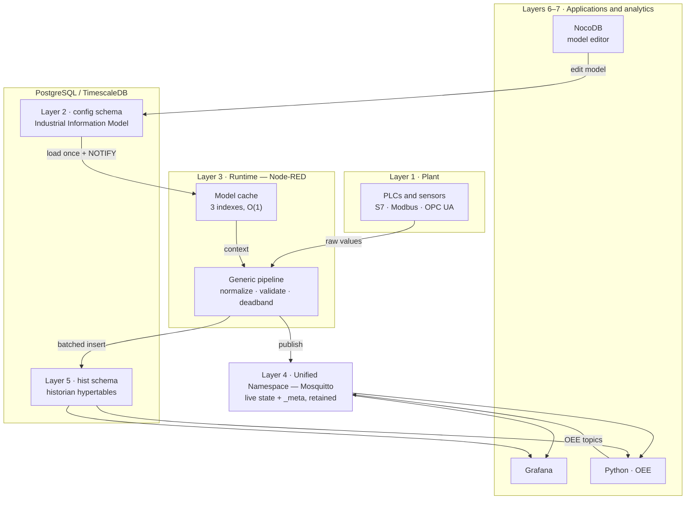
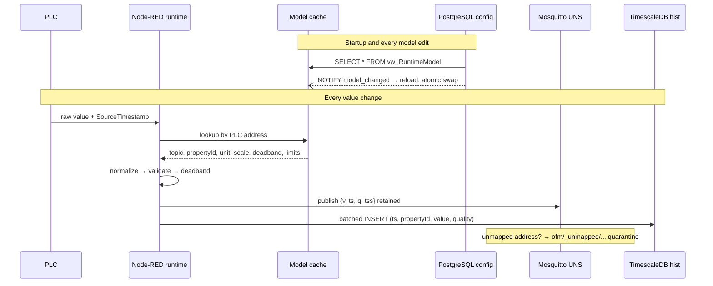

# Open Factory Model (OFM)
## Architecture Overview

| | |
|---|---|
| **Document** | OFM Architecture Overview |
| **Version** | 0.1 (draft for review) |
| **Status** | Living document — updated as decisions are made |
| **Audience** | Engineers building, operating, or contributing to OFM |
| **Companion documents** | Architecture Decision Records (`docs/adr/`), payload JSON Schemas (`schemas/`), database migrations (`db/migrations/`) |

This document is deliberately short. It explains what OFM is, why it is shaped the way it is, and where every deeper detail lives. Anything that can be generated from the information model (topic trees, tag lists, data dictionaries) is *not* documented here — generating it is the point of the platform. Anything that records a contested decision lives in an ADR, not here. This document should be readable in under an hour and should still be true in a year.

---

## 1. Executive summary

OFM (Open Factory Model) is an open-source industrial data platform for manufacturing plants. It provides a single source of truth for operational technology (OT) data by combining two ideas that are usually implemented separately:

**A Unified Namespace (UNS)** — an MQTT broker carrying the live state of the entire plant in a business-oriented topic hierarchy, so that every application (dashboards, MES functions, analytics, AI) consumes one consistent, contextualized stream instead of integrating point-to-point with PLCs.

**An Industrial Information Model (IIM)** — a relational model of the factory in PostgreSQL/TimescaleDB that describes every enterprise, site, area, line, machine, and property, together with its engineering metadata (units, limits, deadbands, PLC mappings). The UNS is *generated from* this model rather than configured by hand.

The defining architectural principle is that OFM is **model-driven**: the database is the single authoritative description of the factory, and every other component — MQTT topics, retained metadata, historian mappings, dashboards, documentation — is derived from it. Adding a sensor to the platform means inserting rows into the model, not editing flows or typing topic strings.

The platform is built entirely from free, open-source components: Node-RED as the runtime engine, Eclipse Mosquitto as the UNS transport, PostgreSQL/TimescaleDB as both the information model and the historian, Grafana for visualization, and Python for analytics. The initial deployment target is a single food-manufacturing site (chocolate production, Melbourne), scaling from one line to plant-wide coverage; the architecture deliberately leaves room for multi-site growth without requiring it.

## 2. Vision and design philosophy

The vision is a plant where the question "what is happening on Line 1 right now, and what happened last Tuesday?" has exactly one answer, obtainable without knowing anything about PLC addresses, vendor protocols, or which engineer wired which flow.

Commercial platforms in this space (HighByte, Ignition, and others) achieve this with a modelling layer coupled to a proprietary runtime. OFM's bet is that the same result can be achieved with a well-designed relational model plus commodity open-source runtimes — and that the model being an ordinary PostgreSQL database, queryable and editable with ordinary tools, is a feature rather than a compromise.

Seven principles govern every design decision. Where a principle was contested or has real costs, the corresponding ADR records the argument.

**Model-driven above all.** The information model generates the system. If a piece of configuration exists outside the database — a topic string typed into a flow, a unit hardcoded in a dashboard — it is a defect to be migrated into the model.

**Configuration over code.** Commissioning a new machine or tag must never require editing a Node-RED flow. Flows are generic executors; the model tells them what to do.

**Context before data.** No value enters the UNS without its business context: which machine, which property, what unit, what quality. Raw register values and PLC addresses never appear north of the runtime layer.

**Loose coupling through the namespace.** Applications never talk to PLCs and never talk to each other directly. They publish to and subscribe from the UNS, or query the historian. Any component can be replaced without the others noticing.

**Separate live state from permanent record.** MQTT distributes current state; TimescaleDB is the durable record. These are different jobs with different guarantees, served by different paths (ADR-0002).

**Honest data quality.** Every value carries a quality flag and a timestamp provenance marker (ADR-0003). The platform prefers visibly flagged uncertainty over silently plausible data.

**Boring technology, few moving parts.** Every component must be self-hostable by a small team, widely documented, and replaceable. New infrastructure (caches, queues, brokers) is added only when a measured problem demands it.

## 3. Scope and requirements

### 3.1 Functional scope

OFM version 1 covers: acquisition of data from industrial controllers (OPC UA as the preferred protocol; Siemens S7, Modbus TCP and MQTT-native devices as required); normalization to engineering units and a canonical payload; contextualization against the information model; publication to the UNS with retained metadata; durable storage of measurements, events, machine states, and production counts in TimescaleDB; operator capture of downtime reason codes; OEE calculation at machine and line level; and visualization through Grafana.

Explicitly out of scope for version 1: closed-loop control through the platform (PLCs remain the control authority; OFM writes setpoints only where a deliberate, per-tag decision is recorded), recipe management beyond identification of the active recipe, batch genealogy, multi-site federation, and safety functions of any kind. Safety circuits and E-stops remain entirely on dedicated safety PLCs and are invisible to OFM.

### 3.2 Non-functional targets

These are engineering targets for a single site, not guarantees; they size the design.

| Concern | Target |
|---|---|
| Tag capacity | 5,000 mapped properties per Node-RED instance |
| Ingest rate | 2,000 value changes/second sustained |
| UNS latency (PLC change → MQTT publish) | < 250 ms typical |
| Model edit → runtime effect | < 1 s (cache reload via NOTIFY) |
| Historian completeness | No loss across broker restarts or DB outages ≤ queue capacity |
| Historian retention | Raw: 90 days; downsampled aggregates: 5 years (tunable per property class) |
| Recovery point objective | ≤ 24 h for the model; ≤ store-and-forward queue depth for telemetry |
| Availability posture | Single-node, restart-tolerant; no HA clustering in v1 |

## 4. System context — the seven layers

OFM organizes responsibilities into seven layers. Each layer talks only to its neighbours; the numbering runs from the physical plant upward.

**Layer 1 — Industrial assets.** The physical plant: lines, machines, motors, valves, sensors, and the PLCs controlling them. OFM observes this layer; it does not replace any part of it.

**Layer 2 — The Industrial Information Model.** The PostgreSQL schema describing Layer 1 and everything OFM should do with its data. Detailed in section 5.

**Layer 3 — The runtime.** Node-RED instances executing generic, model-driven flows: read from controllers, resolve context from the cached model, normalize, validate, publish, and record. Detailed in section 7.

**Layer 4 — The Unified Namespace.** Mosquitto carrying live plant state as retained-where-appropriate MQTT topics in the ISA-95-style hierarchy generated from the model. The UNS holds *current state only* — it is the plant's live digital twin, not its memory.

**Layer 5 — The historian.** TimescaleDB hypertables holding the permanent record: measurements, events, machine state intervals, production counts, energy. Shares the PostgreSQL instance with Layer 2 but lives in a separate schema with separate access roles.

**Layer 6 — Applications.** Grafana dashboards, operator screens, Python services, future MES functions. Applications subscribe to the UNS for live data and query the historian for history. They never communicate with Layers 1–3 directly.

**Layer 7 — Analytics.** OEE, energy KPIs, SPC, and future AI reasoning, computed from the historian and published back into the UNS (e.g., a live OEE topic per line) so that derived insight becomes just another part of the namespace.

The layering rule that matters most in practice: **PLC addresses exist only in Layers 1–3; business context exists everywhere above.** A Grafana dashboard, a Python script, or an AI assistant can be written by someone who has never heard of DB20 or a holding register.

*Figure 1 — System architecture. The model feeds the cache (ADR-0001); the pipeline has two independent outputs: live state to the UNS, permanent record to the historian (ADR-0002). Applications touch only Layers 4–5.*



## 5. The three models

The information model is deliberately split into three sub-models with different lifecycles. The split keeps the schema clean and mirrors three distinct questions about a factory.

**The Physical Model — what exists.** The asset hierarchy: Enterprise → Site → Area → Line → Machine, with optional sub-assets (motor, valve, sensor) below machine level. Rows here change rarely — when equipment is installed, moved, or renamed. Every entity carries an immutable surrogate ID and a mutable display name; all foreign keys and all historian rows reference the ID, never the name, so renaming `Line01` to `MouldingLine01` is a one-column update that automatically re-derives every topic while leaving five years of history intact.

**The Information Model — what is measured.** `MachineProperty` and its supporting tables: for each machine, the properties observed on it (Temperature, Speed, Running, Power…), each with datatype, engineering unit, scaling, deadband, publish policy, alarm limits, historian policy, and display metadata. The `PLCMapping` table binds each property to its current acquisition source (protocol, address, node ID). Mappings are expected to change independently of properties — when maintenance moves a tag from `DB20.Temp` to `DB30.Temp`, one mapping row changes and nothing else in the system notices.

**The Operational Model — what happens over time.** Entities that exist only in time: machine state intervals, downtime records with reason codes, production counts, shifts, operators, recipes-in-effect, alarms, batches. These tables sit at the boundary between configuration and history: their *definitions* (the state vocabulary, the reason-code catalogue, the shift calendar) are configuration; their *instances* are historian data.

Everything else in OFM derives from these three models. The MQTT topic for a property is a deterministic function of its Physical-Model ancestry plus its property name, computed in the `vw_RuntimeModel` view. The retained `_meta` payload is a projection of Information-Model columns. Historian tables key on Information-Model IDs. Grafana dashboards are (in later phases) templated from the model. A separate `AssetRelationship (from_id, to_id, relation_type)` table is present from Phase 1 but unused until the semantic-graph work in section 20 — it is there so that the door stays open without committing to a vocabulary prematurely.

## 6. The Unified Namespace

### 6.1 Topic standard

Topics encode business context only, following the Physical Model hierarchy:

```
{enterprise}/{site}/{area}/{line}/{machine}/{property}
mondelez/melbourne/chocolate/eggline01/depositor01/temperature
```

Naming rules are enforced by the database (CHECK constraints on name columns), not by convention: lowercase, `a–z0–9_` only, no spaces, and never the MQTT-reserved characters `#`, `+`, `/` inside a segment. Because topics are generated, a malformed topic cannot reach the broker. Sub-asset properties extend the path by one segment (`.../depositor01/motor01/current`).

Three reserved first-level branches exist outside the asset hierarchy: `ofm/_system/...` for platform health (cache status, historian queue depth), `ofm/_unmapped/...` for quarantined values whose PLC address is not in the model (ADR-0001), and `ofm/_cmd/...` for the deliberate, per-tag write-back paths, kept separate so that ACLs can treat commands differently from telemetry.

### 6.2 Live payload

Every telemetry topic carries one canonical JSON payload, defined normatively in `schemas/value.schema.json`:

```json
{
  "v": 25.4,
  "ts": 1783948925123,
  "q": "good",
  "tss": "device"
}
```

`v` is the value after normalization (engineering units, correct datatype); `ts` is epoch milliseconds UTC; `q` is quality (`good` | `uncertain` | `bad`); `tss` is timestamp provenance (`device` | `gateway`) per ADR-0003. Keys are terse deliberately — this payload is published thousands of times per second and parsed by everything. Values are published on change-after-deadband, retained, so any newly connected subscriber immediately receives current plant state.

### 6.3 Metadata topics

Each property additionally exposes `.../{property}/_meta`, retained, republished only when the model changes:

```json
{
  "propertyId": 145,
  "datatype": "float",
  "unit": "degC",
  "displayName": "Chocolate temperature",
  "low": 18.0, "high": 35.0,
  "alarmLow": 20.0, "alarmHigh": 32.0,
  "description": "Chocolate after temperer"
}
```

The split between live and meta topics keeps the hot payload small while making the namespace self-describing: a consumer can discover the entire plant, with engineering context, by subscribing to `+/+/+/+/+/+/_meta` and never touching the database. The `propertyId` field is the bridge for consumers that need to join UNS data with historian queries.

### 6.4 What the UNS is not

The UNS carries current state, not history and not guaranteed delivery. Consumers requiring completeness read the historian (ADR-0002). The broker is Mosquitto with TLS, per-role ACLs (section 14), and no anonymous access; plain MQTT with JSON was chosen over Sparkplug B for v1 because human-readable payloads and a hand-shaped ISA-95 tree were judged more valuable than Sparkplug's birth/death semantics at single-site scale — recorded as a revisit-able decision (future ADR if multi-site or Ignition interoperability changes the calculus).

## 7. Runtime architecture

### 7.1 The generic pipeline

Node-RED runs a small number of *generic* flows; none contains machine-specific logic. The ingest pipeline for every value is:

```
acquire (OPC UA subscribe / S7 poll / Modbus poll)
  → cache lookup (PLC address → property context)     [O(1), no SQL]
  → normalize (scale, cast, unit)
  → validate (range, datatype, timestamp sanity)
  → deadband + rate limit (per-property policy)
  → publish UNS (retained, canonical payload)
  → historian write (batched, parallel path)
```

Unmapped addresses divert to quarantine after the lookup step. Write-back (`_cmd`) flows run the pipeline in reverse with explicit per-tag enablement in the model.

*Figure 2 — Runtime data flow. The model-change path (top) and the per-value path (bottom) never intersect: configuration edits reach the runtime through cache reload, and the hot path issues no SQL for model resolution.*



### 7.2 The model cache

Per ADR-0001, the runtime never queries SQL on the hot path. On startup, Node-RED loads `SELECT * FROM vw_RuntimeModel` — a view that pre-joins the full Physical and Information Models and pre-computes each property's topic — and builds three global-context indexes: by PLC address (ingest), by machine ID (state and OEE logic), and by MQTT topic (command path). PostgreSQL triggers on all configuration tables fire `NOTIFY model_changed`; a listener flow reloads the view and atomically swaps all three indexes, giving a model-edit-to-runtime latency under one second with no restarts and no polling.

### 7.3 Runtime topology

One Node-RED instance per plant is the Phase 1 topology. The scaling unit is the instance: if tag count, CPU, or blast-radius concerns demand it, additional instances are added per area or per line, each owning a disjoint set of PLC mappings (an `owner` column in `PLCMapping`) and each running the identical generic flows against the same model. Node-RED is single-threaded; the ceiling per instance is expected around the targets in section 3.2 and will be validated with load tests in Phase 2.

## 8. Historian architecture

Per ADR-0002, history is written directly from the runtime to TimescaleDB, in parallel with — never through — the broker. Telemetry inserts are batched (1–2 s flush); MES-significant events (state changes, counts, downtime) are written transactionally per event. A local disk queue provides store-and-forward across database outages, with queue depth exposed on `ofm/_system/historian`.

The historian schema is narrow and ID-keyed. `measurement (ts timestamptz, property_id int, value double precision, quality smallint, ts_source smallint)` is a hypertable partitioned on `ts`; text values and states go to sibling tables rather than overloading one table with nullable columns. Native TimescaleDB compression is applied after 7 days and continuous aggregates maintain 1-minute and 1-hour rollups per property, which serve most dashboard queries and the 5-year retention tier while raw data ages out at 90 days. Operational-Model instance tables (`machine_state_history`, `production_count`, `downtime`, `event`) follow the same pattern: immutable IDs, `timestamptz`, no display names.

Nothing in the historian references topics or display names. Historical queries join to the model at read time, so equipment renames and topic restructures never corrupt history.

## 9. Timestamps and data quality

ADR-0003 in one paragraph: source timestamps (OPC UA `SourceTimestamp`, publisher time for MQTT sources) are used whenever available, gateway arrival time is the flagged fallback, and provenance travels with every value (`tss` in payloads, `ts_source` in the historian). All times are epoch milliseconds UTC in the data path; Australia/Melbourne local time exists only in display layers. The ingest pipeline flags future-skewed (> 5 min) and regressing device timestamps as `uncertain` rather than dropping them, making unsynchronised PLC clocks a visible data-quality signal. NTP synchronisation of PLCs, runtime host, and database host is a commissioning-checklist item for every device.

## 10. Machine states and OEE

### 10.1 State model

Machine states are captured as *transitions*, not derived after the fact. Each machine's state — from the fixed vocabulary `running, idle, blocked, starved, fault, setup, cleaning, maintenance` — is evaluated in the runtime from PLC signals according to per-machine rules stored in the model. On every transition, the runtime publishes the new state to the UNS (retained, so current state is always readable at `.../{machine}/state`) and transactionally closes the previous interval and opens the next in `machine_state_history`. Deriving states retrospectively from raw signals is explicitly rejected: transition-time capture is simpler, auditable, and gives operators something to annotate while memory is fresh.

The vocabulary is fixed platform-wide; per-machine mapping from PLC signals to states is configuration. `cleaning` is first-class rather than a downtime reason because in food manufacturing hygiene time is planned, measured, and excluded differently from failure time in OEE availability.

### 10.2 Reason codes and the operator

Downtime *causes* cannot come from the PLC. When a stoppage (any non-`running` interval outside planned exclusions) exceeds a configurable threshold, an operator screen — Node-RED Dashboard 2.0 in early phases — presents the reason-code catalogue from the Operational Model, filtered to that machine's applicable codes, and writes the selection to the `downtime` table. Un-coded intervals remain visible as "unclassified" on dashboards; making the gap visible is the enforcement mechanism, not blocking the operator.

### 10.3 OEE calculation

OEE is computed in SQL over historian tables, not in the runtime: availability from `machine_state_history` against the shift calendar; performance from `production_count` against the ideal cycle time of the recipe in effect; quality from good/reject counts. Machine OEE aggregates to line, area, and site by model-defined roll-up rules. Results are both queryable (Grafana) and republished to the UNS (`.../{line}/oee/...`) by a scheduled Python job, so live OEE is an ordinary namespace citizen. Definitions (what counts as planned time, which states hit availability) live in the model and are versioned — an OEE number without its definition version is treated as meaningless.

## 11. Configuration management

The model is edited through three doors, all converging on the same PostgreSQL schema with the same constraints and audit trail. **NocoDB** (or Baserow) provides the human interface in early phases: relational grids with foreign-key dropdowns, validation, and change history over the configuration schema — deferring any custom UI until the schema has survived contact with reality. **SQL migrations** (numbered files under `db/migrations/`, applied by Flyway or plain psql discipline) are the only mechanism that changes schema *structure*; the migration history in Git is the schema documentation. **Direct SQL** remains available to engineers, because the model being an ordinary database is the point.

Every configuration table carries `created_at, created_by, updated_at, updated_by`, and an `audit_log` table records old/new row images via trigger. In a food plant, "who changed the alarm limit on that temperature and when" is a question with a compliance dimension; the platform must answer it without archaeology. Model changes propagate to the runtime via NOTIFY (section 7.2) and to consumers via republished `_meta` topics — no restarts anywhere.

## 12. Technology stack

| Role | Choice | Why this, briefly |
|---|---|---|
| Information model + historian | PostgreSQL 16 + TimescaleDB | One engine for both jobs; excellent relational core; hypertables, compression, continuous aggregates for time-series |
| Runtime | Node-RED | Protocol node ecosystem (OPC UA, S7, Modbus), low-code visibility for OT engineers, good-enough throughput per instance |
| UNS transport | Eclipse Mosquitto | Lightweight, ubiquitous, MQTT 5, trivial to operate; clustering not needed at single-site scale |
| Visualization | Grafana | First-class TimescaleDB and MQTT support; the de facto standard |
| Analytics | Python | OEE jobs, SPC, future AI; talks natively to both PostgreSQL and MQTT |
| Config UI (interim) | NocoDB / Baserow | Validated relational editing over the live schema with zero custom code |
| Deployment | Docker Compose | Whole platform as one reviewable file; sufficient below Kubernetes scale |

Substitution points are deliberate: EMQX can replace Mosquitto if clustering is ever needed; additional Node-RED instances (or a Benthos pipeline for a hot path) can join without touching the model; Grafana is replaceable by anything that speaks SQL and MQTT. The model schema is the one component with real switching costs, which is why it gets migrations, audit, and ADRs while everything else gets a Compose entry.

## 13. Security architecture

OFM assumes a segmented OT network and adds application-layer controls on top; it never substitutes for network segmentation. The runtime host sits in the OT/IT DMZ pattern: plant protocols (S7, Modbus, OPC UA) terminate at the runtime and are never routed north; only MQTT-over-TLS and PostgreSQL-over-TLS cross upward. Modbus and S7 have no native security, so their segments are isolated at the network layer; OPC UA connections use signed-and-encrypted mode with certificates where the controller supports it.

Mosquitto runs with TLS, no anonymous access, and per-role ACLs: acquisition credentials may publish telemetry but not `_cmd`; applications may subscribe broadly but publish nothing; only the command flow's credential may publish `_cmd`, and only operator-facing services may trigger it. PostgreSQL follows the same least-privilege split — `ofm_runtime` (SELECT on model, INSERT on historian), `ofm_config` (DML on configuration schema, used by NocoDB), `ofm_reader` (Grafana/analytics, read-only) — so a compromised dashboard cannot alter the model and a compromised runtime cannot rewrite history. Secrets live in the deployment environment (Compose env files with restricted permissions in v1), never in flows or the repository.

## 14. Deployment architecture

The reference deployment is a single Docker Compose stack on one industrial-grade Linux host at the site: `postgres` (with TimescaleDB), `mosquitto`, `nodered`, `grafana`, `nocodb`, plus named volumes for each stateful service and the store-and-forward queue directory. The Compose file in the repository *is* the deployment documentation.

Placement matters more than orchestration at this scale: the runtime must be network-close to the PLCs (polling latency, broadcast domains), and the historian benefits from local SSD. A second host can split the stack (runtime at the edge; database, Grafana and NocoDB on a server VM) with no architectural change — every arrow between containers is already TCP with TLS. Kubernetes is explicitly not used in v1; the operational cost is not justified for a single-site, restart-tolerant posture. The home-lab and the plant run the identical Compose file with different `.env` values, which keeps the development environment honest.

## 15. Performance and scalability

The design scales in three independent dimensions. **Tags** scale by adding Node-RED instances partitioned by `PLCMapping.owner` (section 7.3) — the cache, flows, and model are identical per instance. **Consumers** scale freely on the broker side; Mosquitto handles the realistic single-site subscriber count, and retained messages mean new consumers impose no replay load. **History** scales with TimescaleDB chunking, compression (~90 % typical on telemetry), and continuous aggregates that keep dashboard queries off raw data.

Known ceilings, recorded so they are watched rather than discovered: Node-RED single-thread throughput (validated by Phase 2 load test against the 2,000 msg/s target); Mosquitto's single-node nature (no HA — acceptable per section 3.2's availability posture; a broker restart costs seconds of live-state visibility and zero history thanks to ADR-0002); and PostgreSQL insert throughput, which batching keeps far below limits at target rates. Each ceiling has a named escape hatch (more instances; EMQX; ingest via a queue) that is deliberately *not* built until measurement demands it.

## 16. Backup and disaster recovery

Two things need protecting, and they differ. **The model** is small, precious, and slow-changing: nightly `pg_dump` of the configuration schema, retained 90 days, tested by an automated restore-and-diff job — plus, in effect, a second life in Git via migrations and NocoDB audit history. **The historian** is large and append-only: weekly base backup plus WAL archiving (pgBackRest) with the RPO defined by WAL shipping frequency; store-and-forward in the runtime covers database downtime up to queue capacity, so a restore loses no telemetry within that window.

Broker state is deliberately expendable — retained messages regenerate from the runtime within one publish cycle of each property, so Mosquitto needs no backup beyond its config file (in Git). Recovery of the full platform on fresh hardware is: restore PostgreSQL, `docker compose up`, and wait one cache-load plus one publish cycle. This procedure is rehearsed, not assumed — a DR rehearsal is a Phase 3 exit criterion.

## 17. Testing strategy

The strategy leans on the model-driven design: because flows are generic, testing effort concentrates on a small pipeline instead of per-machine logic. Four tiers. **Schema tests** (pgTAP or plain SQL assertions in CI) verify constraints, the naming rules, `vw_RuntimeModel` correctness, and NOTIFY triggers. **Pipeline tests** run the ingest flow against a simulated source — an OPC UA test server and a Modbus simulator publishing known patterns — and assert the exact UNS payloads and historian rows produced, including deadband, quality-flagging, and quarantine behaviour. **Failure drills** are scripted, not aspirational: kill the broker mid-stream (history must be complete afterwards), kill PostgreSQL (UNS must keep flowing; queue must drain on recovery), send an unmapped address, send a skewed timestamp. **Load tests** validate the section 3.2 targets before each phase exit.

The simulator doubles as the development environment: contributors without PLC hardware run the full stack against simulated lines, which is also how the home-lab-to-plant path stays credible.

## 18. Roadmap

| Phase | Deliverable | Exit criterion |
|---|---|---|
| 1 | Model schema (config + historian DDL, migrations, audit), Mosquitto, generic ingest for one real PLC, Grafana | One line's temperatures flowing PLC → UNS → historian → dashboard from model configuration only |
| 2 | Cache + LISTEN/NOTIFY, `_meta` topics, deadbanding, batched historian writer, store-and-forward, NocoDB, load test | Model edit visible in runtime < 1 s; broker-kill drill passes; 2,000 msg/s sustained |
| 3 | State model, counts, downtime capture, operator reason-code screen, OEE queries and republication, DR rehearsal | Line OEE on a dashboard traceable to raw intervals; restore rehearsal documented |
| 4 | Dashboard templating from the model, Python analytics framework, semantic relationships (populate `AssetRelationship`) | New machine gets default dashboards with zero Grafana editing |
| 5 | `node-red-contrib-ofm` custom nodes, REST API over the model, AI assistant over model + historian | Property commissioning via dropdowns; natural-language operational queries |

Each phase is independently useful; nothing in a later phase is load-bearing for an earlier one. Documentation grows with the phases: ADRs as decisions are made, generated artefacts (topic tree, data dictionary) from Phase 2, and the comprehensive reference document — the "book" — only once it can be written about working software and partly generated by it.

## 19. Future directions

Three directions are anticipated by the architecture but deliberately unbuilt. **Semantic relationships**: populating `AssetRelationship` with a curated vocabulary (`feeds`, `supplies`, `belongs_to`) turns the Physical Model into a graph, enabling impact analysis ("everything downstream of Tank01") and richer diagnostics; the vocabulary will be chosen after operating experience, not before. **Custom Node-RED nodes** (`node-red-contrib-ofm`): a Factory Asset node with cascading model-driven dropdowns replaces the generic subflow for commissioning ergonomics — valuable, but only worth building against a stabilized schema. **AI over the model**: because the model is a well-structured relational description of the plant and the UNS is self-describing, an LLM-based assistant can be grounded on `vw_RuntimeModel`, `_meta` topics, and historian aggregates to answer operational questions; the model-driven principle is what makes this tractable, and it is the long-term payoff of keeping that principle strict.

## 20. Document map

Where the details live, by concern: contested decisions and their alternatives → `docs/adr/` (ADR-0001 cache, ADR-0002 historian path, ADR-0003 timestamps, and successors); payload contracts → `schemas/*.schema.json` (normative); database structure → `db/migrations/` (normative) with diagrams regenerated from the live schema; deployment → `deploy/docker-compose.yml` and its `.env.example`; generated references (topic tree, tag list, data dictionary) → `docs/generated/`, produced by `tools/gen_docs.py` from the model and never edited by hand. When this overview and a normative artefact disagree, the artefact wins and this document gets a correcting commit.

---

*End of Architecture Overview v0.1. Corrections and challenges are welcome — disagreement with anything in sections 5–9 should arrive as a proposed ADR.*
