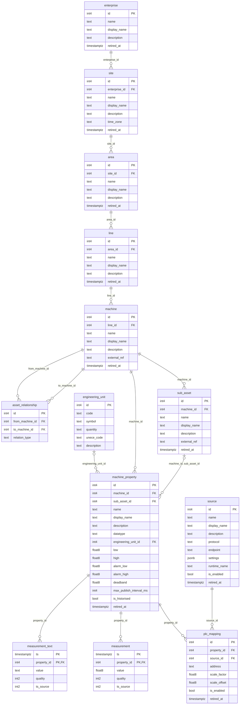

# Database structure (generated)

Generated from the live database by `docker compose run --rm migrate erd`. Do not edit by hand. Audit columns (created_*/updated_*) are omitted.

```mermaid
erDiagram
  area {
    int4 id PK
    int4 site_id FK
    text name
    text display_name
    text description
    timestamptz retired_at
  }
  asset_relationship {
    int4 id PK
    int4 from_machine_id FK
    int4 to_machine_id FK
    text relation_type
  }
  engineering_unit {
    int4 id PK
    text code
    text symbol
    text quantity
    text unece_code
    text description
  }
  enterprise {
    int4 id PK
    text name
    text display_name
    text description
    timestamptz retired_at
  }
  line {
    int4 id PK
    int4 area_id FK
    text name
    text display_name
    text description
    timestamptz retired_at
  }
  machine {
    int4 id PK
    int4 line_id FK
    text name
    text display_name
    text description
    text external_ref
    timestamptz retired_at
  }
  machine_property {
    int4 id PK
    int4 machine_id FK
    int4 sub_asset_id FK
    text name
    text display_name
    text description
    text datatype
    int4 engineering_unit_id FK
    float8 low
    float8 high
    float8 alarm_low
    float8 alarm_high
    float8 deadband
    int4 max_publish_interval_ms
    bool is_historised
    timestamptz retired_at
  }
  measurement {
    timestamptz ts PK
    int4 property_id PK,FK
    float8 value
    int2 quality
    int2 ts_source
  }
  measurement_text {
    timestamptz ts PK
    int4 property_id PK,FK
    text value
    int2 quality
    int2 ts_source
  }
  plc_mapping {
    int4 id PK
    int4 property_id FK
    int4 source_id FK
    text address
    float8 scale_factor
    float8 scale_offset
    bool is_enabled
    timestamptz retired_at
  }
  site {
    int4 id PK
    int4 enterprise_id FK
    text name
    text display_name
    text description
    text time_zone
    timestamptz retired_at
  }
  source {
    int4 id PK
    text name
    text display_name
    text description
    text protocol
    text endpoint
    jsonb settings
    text runtime_name
    bool is_enabled
    timestamptz retired_at
  }
  sub_asset {
    int4 id PK
    int4 machine_id FK
    text name
    text display_name
    text description
    text external_ref
    timestamptz retired_at
  }
  area ||--o{ line : "area_id"
  engineering_unit |o--o{ machine_property : "engineering_unit_id"
  enterprise ||--o{ site : "enterprise_id"
  line ||--o{ machine : "line_id"
  machine_property ||--o{ measurement_text : "property_id"
  machine_property ||--o{ measurement : "property_id"
  machine_property ||--o{ plc_mapping : "property_id"
  machine ||--o{ asset_relationship : "from_machine_id"
  machine ||--o{ asset_relationship : "to_machine_id"
  machine ||--o{ machine_property : "machine_id"
  machine ||--o{ sub_asset : "machine_id"
  site ||--o{ area : "site_id"
  source ||--o{ plc_mapping : "source_id"
  sub_asset |o--o{ machine_property : "machine_id, sub_asset_id"
```
